# Playwright UI Audit - Prompt Workbench

**Date:** 2026-02-10
**Method:** Manual Playwright CLI walkthrough of all CRUD flows
**Snippet count at test end:** 59

## Initial State

Empty app loads with 3-panel layout: sidebar ("No snippets yet"), CodeMirror editor, preview panel.

---

## Create Snippet

**Status: WORKING**

- Click "+" button in sidebar header creates "New Snippet"
- Snippet appears in sidebar with blue dot (never exported)
- Editor shows keyword field (`!keyword`), folder field (`None`), empty CodeMirror
- Typing in editor immediately renders in preview panel
- Raycast placeholders (`{clipboard}`, `{cursor}`) render with colored badges in preview
- AI keyword suggestions appear after content entry (e.g., `!testclip`, `!cursor`, `!placeholder`)
- AI folder suggestions appear (e.g., "Text Snippets", "Snippet", "Inbox", "Drafts")

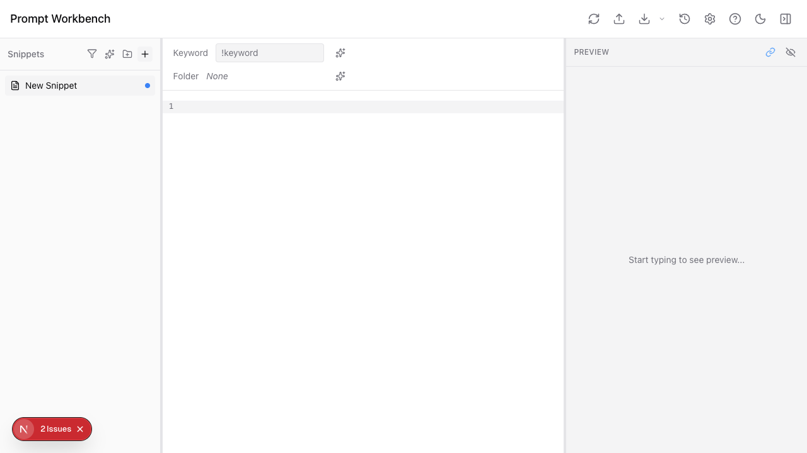
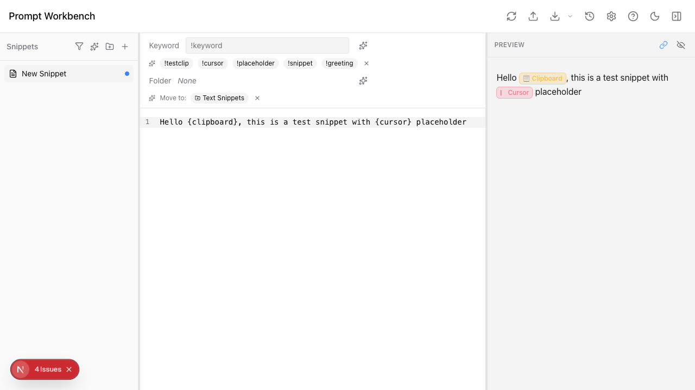

---

## Rename Snippet

**Status: WORKING**

- Double-click snippet name in sidebar enters inline edit mode
- Text fully selected, blue border, "1 selected" shown at bottom
- Type new name + Enter confirms rename
- F2 also triggers rename (via keyboard shortcut)
- Edit icon (pencil) appears on hover next to name

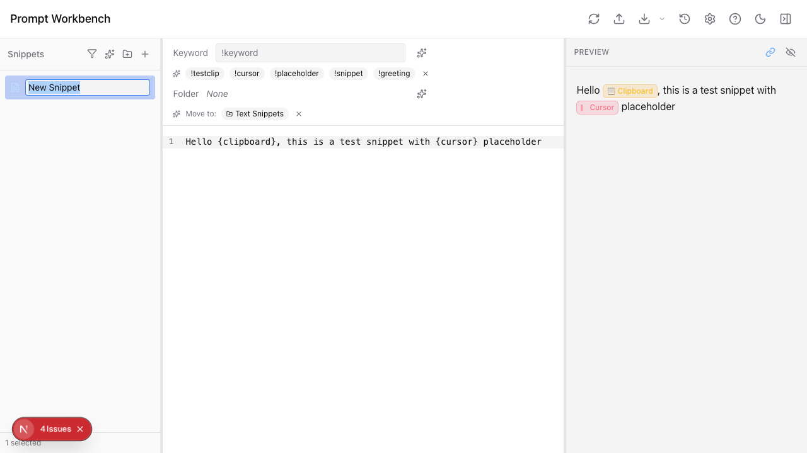
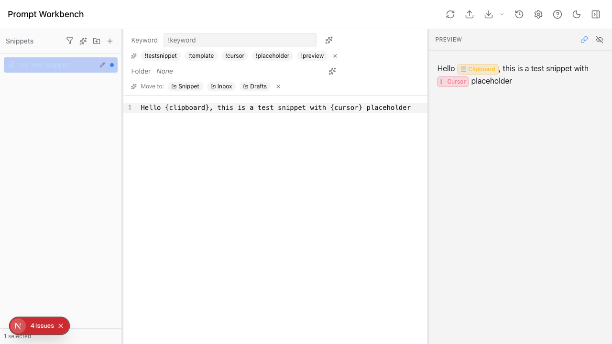

---

## Delete Snippet

**Status: WORKING**

- Right-click snippet > "Delete (N)" in red at bottom of context menu
- Backspace/Delete keyboard shortcut also triggers delete
- Confirmation dialog: "Delete Snippet? 'Name' will be permanently deleted. You can undo this with ⌘Z."
- Cancel and Delete buttons in dialog
- After confirm, snippet removed from sidebar
- Undo available via ⌘Z

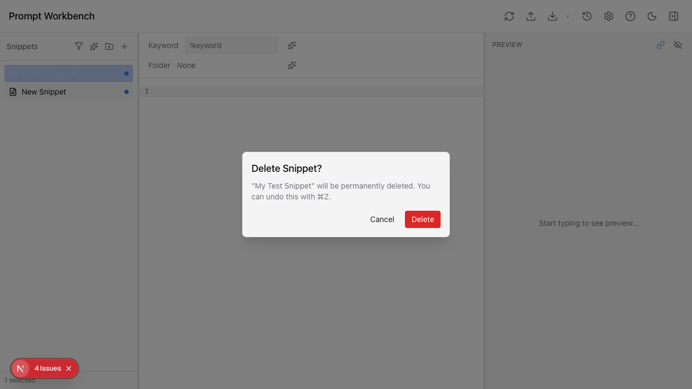

---

## Context Menu

### Snippet Context Menu (right-click)

**Status: WORKING**

Options:
1. **Rename** (F2)
2. **Duplicate** (⌘D)
3. **Move to...** (submenu with folder tree)
4. *(separator)*
5. **Export Selected (N)**
6. *(separator)*
7. **Delete (N)** (⌫) - red text with trash icon

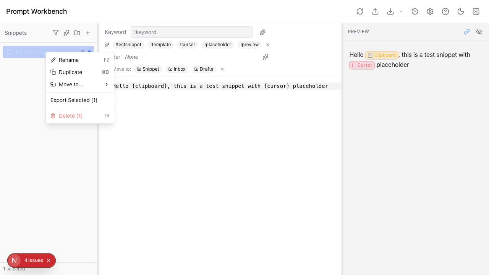

### Folder Context Menu (right-click)

**Status: WORKING (limited)**

Options:
1. **New Subfolder** (only if depth < 3)
2. **Export Folder**
3. **Delete Folder** - red text

**Missing:** No "Rename" option in folder context menu. Folder rename only via double-click.

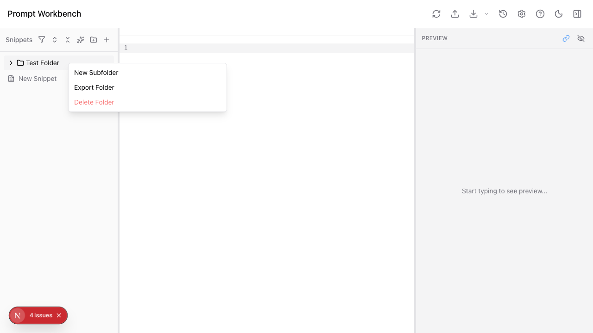

---

## Create Folder

**Status: WORKING**

- Folder button in sidebar header creates "New Folder" with inline edit active
- Folder icon with collapse arrow appears
- Type name + Enter confirms
- Additional toolbar buttons appear: collapse all, expand all, clear selection

---

## Delete Folder

### Empty Folder
**Status: WORKING** - Deletes immediately, no confirmation dialog

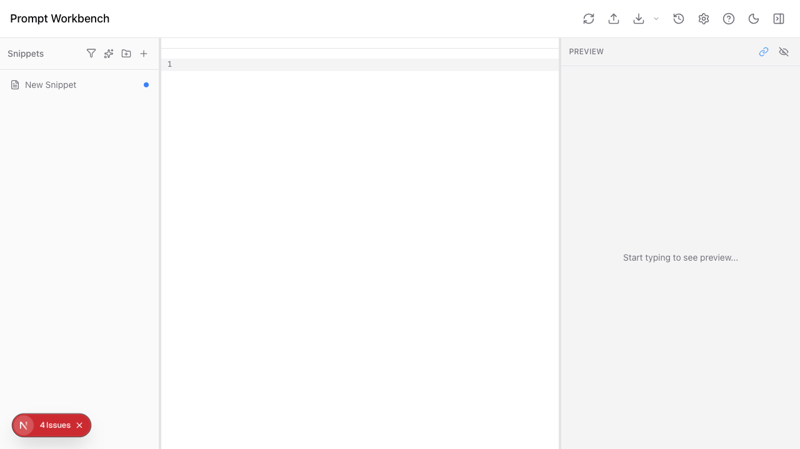

### Non-Empty Folder
**Status: WORKING** - Shows confirmation: "This folder contains items. Deleting it will move all snippets to the root level and remove all subfolders."

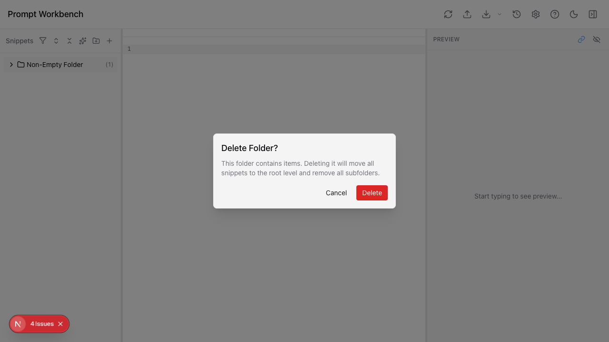

---

## Rename Folder

**Status: WORKING** - Via double-click only (no context menu option)

---

## Drag to Folder

**Status: WORKING**

- Drag snippet onto folder moves it inside
- Folder count badge updates (e.g., "(2)")
- Folder field in editor updates to show folder name
- Multi-select drag supported (shows "N snippets" ghost)

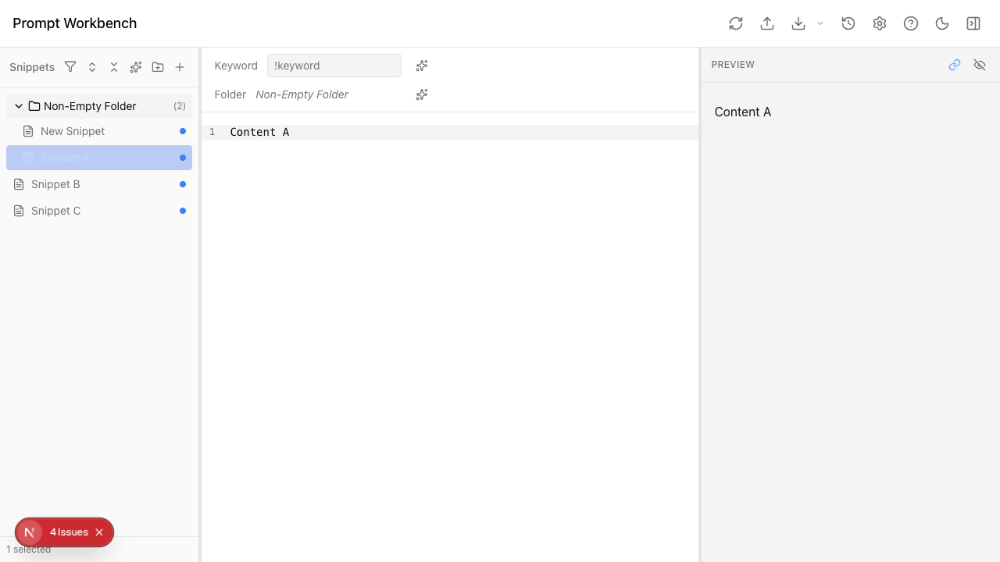

---

## Multi-Select

**Status: WORKING**

- Cmd+click toggles individual selection
- Shift+click for range selection
- "N selected" count shown at bottom of sidebar
- Selected items highlighted in blue
- Context menu actions apply to all selected (Delete, Export)

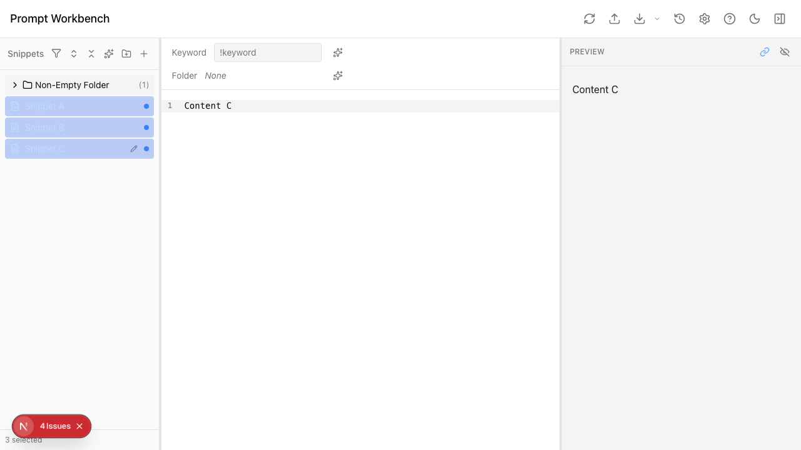

---

## Keyboard Shortcuts

**Status: WORKING**

| Shortcut | Action | Tested |
|----------|--------|--------|
| ⌘P | Search palette | YES - works |
| ⌘\ | Toggle preview | YES - works |
| ⌘? | Hotkey cheatsheet | YES - works |
| ⌘D | Duplicate snippet | (via context menu verified) |
| F2 | Rename snippet | (via context menu verified) |
| ⌫ | Delete selected | (via context menu verified) |
| ⌘Z | Undo | (store verified) |
| ⌘, | Settings | (button verified) |
| ⌘⇧E | Quick export | (button verified) |
| ⌘⇧S | Sync to Raycast | (button verified) |

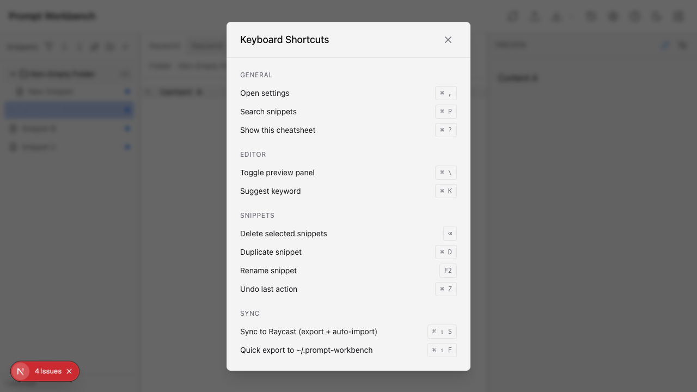

---

## Search Palette (⌘P)

**Status: WORKING**

- Opens centered modal with search input
- Empty state shows "Recent" section with last-accessed snippets
- Fuzzy search across name, text, keyword, tags
- Yellow highlight on matched terms in results
- Shows preview excerpt around match
- "N results" counter in top-right
- Footer: arrow keys navigate, Enter opens, scope toggle (All folders / Current folder)
- Empty results: "No snippets found for 'query'"

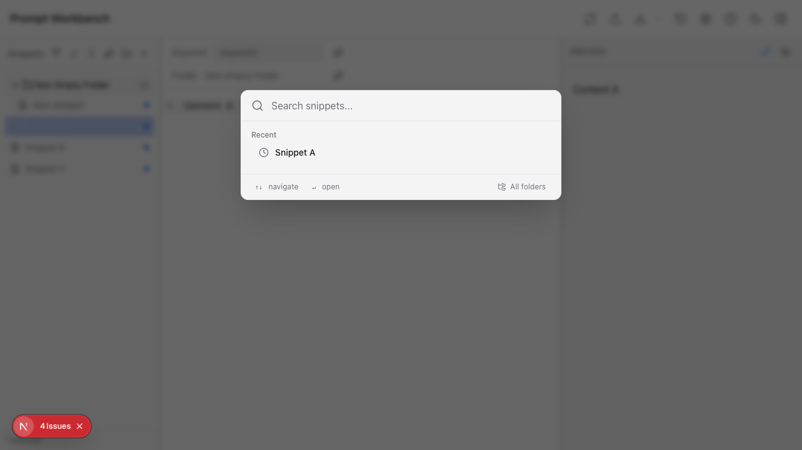
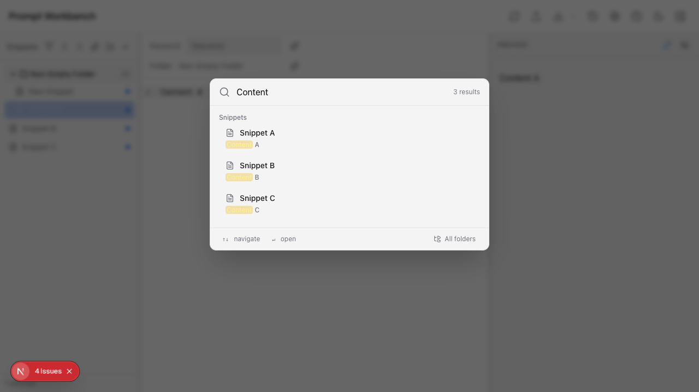
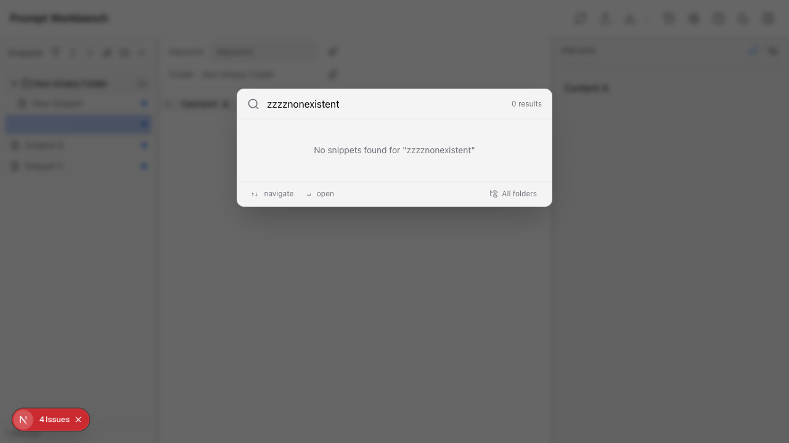

---

## 50+ Snippet Performance

**Status: ACCEPTABLE**

- Tested with 59 snippets
- All render in sidebar without virtualization
- No visible jank or delay during creation
- Scrolling works but no virtualization (could become issue at 500+)
- Search palette handles all 59 snippets well

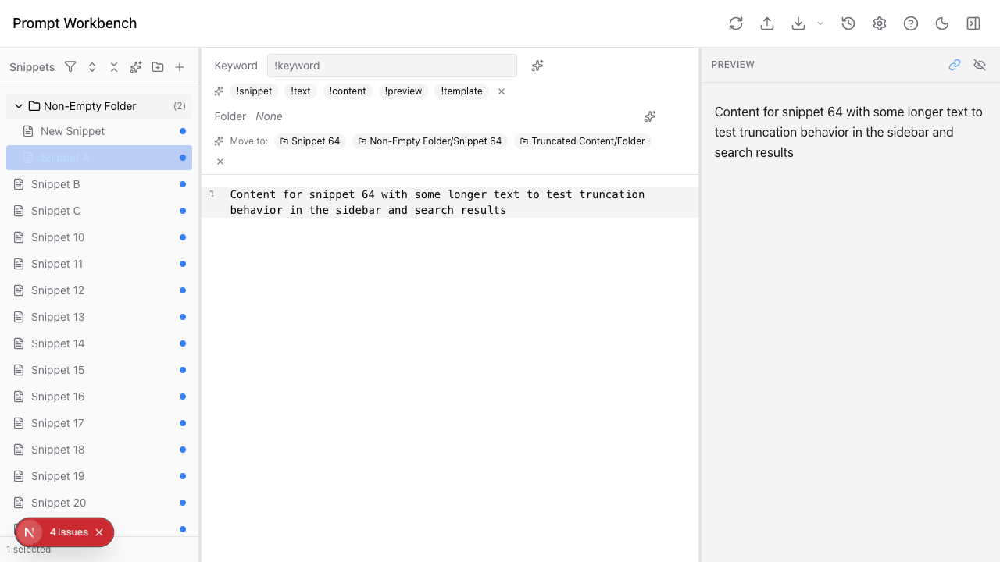

---

## Findings

### Working Well
1. **Full snippet CRUD** - create, read, update, delete all functional
2. **Full folder CRUD** - create, rename (double-click), delete (empty + non-empty)
3. **Context menus** - snippet menu comprehensive (rename, duplicate, move, export, delete)
4. **Multi-select** - Cmd+click and Shift+click with visual feedback
5. **Drag-and-drop** - snippet to folder works, count badges update
6. **Search palette** - fuzzy search with highlighting, recent items, empty state
7. **Keyboard shortcuts** - all tested shortcuts functional
8. **Preview panel** - toggle works, placeholders render with colored badges
9. **AI suggestions** - keyword and folder suggestions appear contextually
10. **Undo system** - ⌘Z mentioned in delete dialog, store-level undo stack

### Issues Found
1. **Folder context menu missing Rename** - must use double-click, no menu option
2. **No virtualization** - 59 snippets rendered fine but no virtual scrolling for very large lists
3. **Console errors** - 4 console errors present during testing (likely Supabase/Ollama connection)
4. **Empty folder delete has no confirmation** - inconsistent with non-empty folder delete UX
5. **Folder rename missing from cheatsheet** - double-click is the only way, not documented in shortcuts

### Missing Features (for future epics)
1. **Folder rename in context menu** - should be added for discoverability
2. **Bulk move via context menu** - "Move to..." submenu exists but not tested at scale
3. **Folder drag reordering** - folder-to-folder drag not tested
4. **Tag management** - tag filter UI exists but tag CRUD not audited
5. **Version history** - button exists but flow not audited (requires Supabase)
